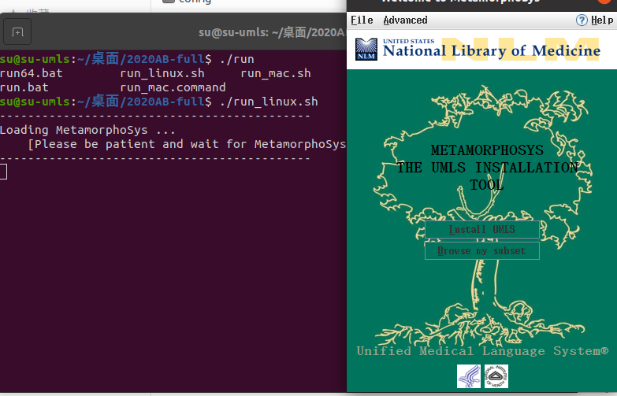
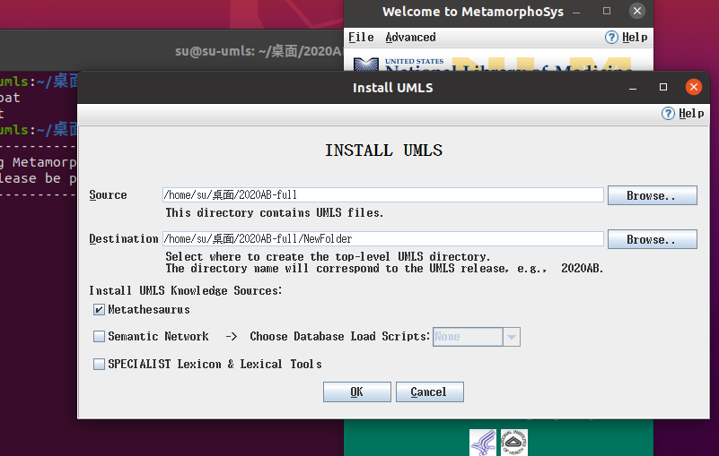
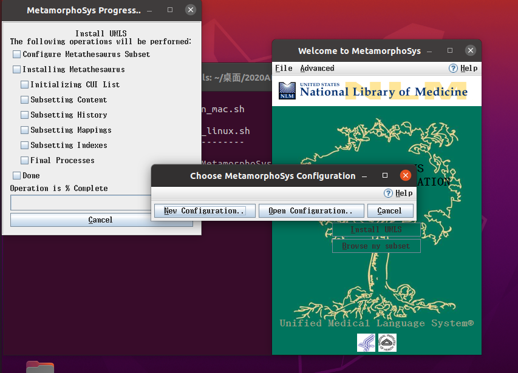
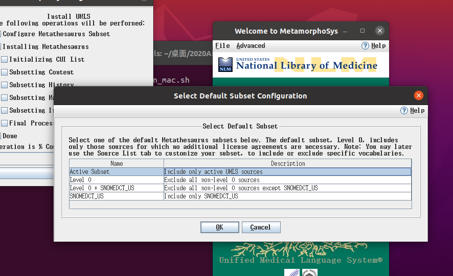
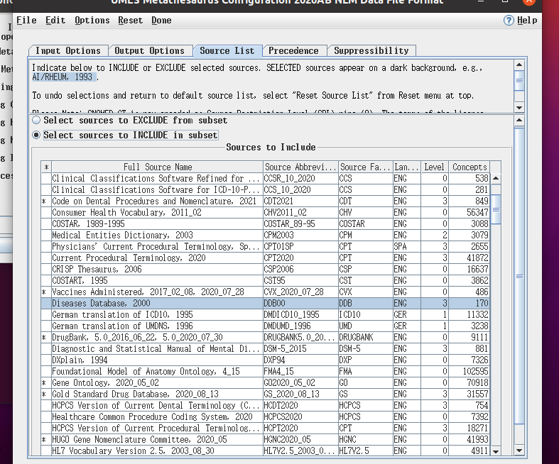
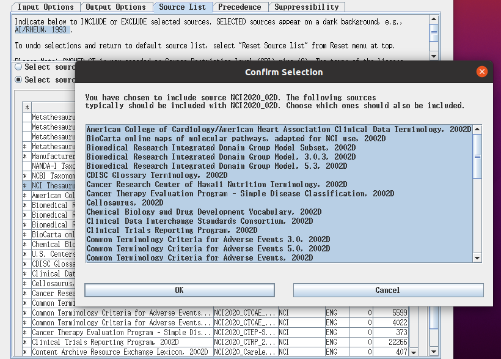
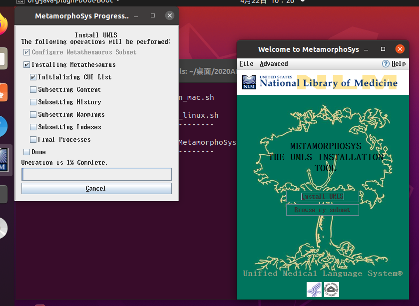
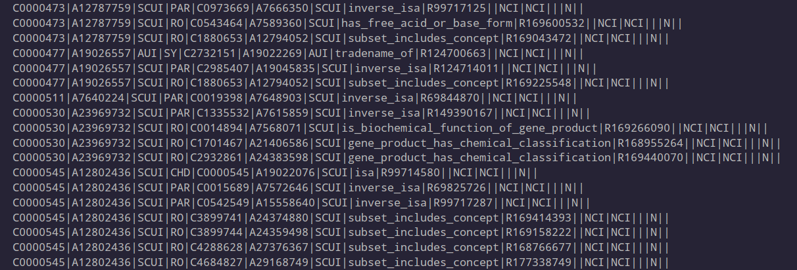
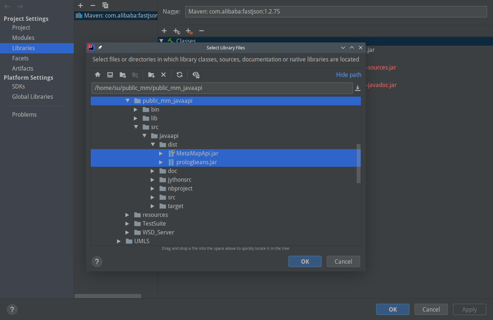

# 远程监督数据标注

下载MetaMap和UMLS,使用MetaMap找到句子中可能包含的所有实体以及实体的CUI，再根据实体CUI与UMLS中的关系三元组进行对齐，标注两个实体间关系.

## 下载安装UMLS

[下载连接](https://download.nlm.nih.gov/umls/kss/2020AB/umls-2020AB-full.zip) 需要注册账号，账号审核大概3天左右。下载完成后进行解压。

1. 进入解压后的目录，运行脚本，会打开如下图所示的GUI。

```bash
cd 2020AB-full
./run_linux.sh
```



2. 选择`Install UMLS` ,Destination一个新建好的空文件夹即可，下面的两个勾可以不进行勾选。



3. 点击`OK`进入下一步，这里选择`New Configuration`新建配置文件，主要是为了进行数据集的选择。



4. 选择默认数据源，这里选择第一个就可以

   

5. 点击`OK`来到下图所示界面，选择子数据集来源。先选择`Select source to INCLUDE in subset`这一选项。

   之后在`Source to Include`列表中选择`Diseases DataBase 2000   DDB00 DDB` 这一来源 以及 `NCI`全体。多选按住`ctrl`

   

   选择一个NCI来源的数据子集，就会提示你是否将NCI来源的全部数据加入子集。这里全部加入。



6. 之后在菜单栏中，点击`Done`, `Begin Subset`，保存配置文件，之后开始构建子集。

   

   耐心等待



7. 获取关系数据集

   之后进入我们之前新建的文件夹中。 进入该目录下`NewFolder/2020AB/META`找到`MREEL.RRF`.这里面就包含我们想要的关系三元组。

   

## 下载安装MetaMap

[MetaMap下载连接](https://metamap.nlm.nih.gov/MainDownload.shtml)

[JavaApi下载链接](https://metamap.nlm.nih.gov/JavaApi.shtml)

[MetaMap NLM Common Data下载链接](https://metamap.nlm.nih.gov/download/DataSets/public_mm_data_nlm_2020aa_base.tar.bz2)、[MetaMap NLM Strict Model Data下载链接](https://metamap.nlm.nih.gov/download/DataSets/public_mm_data_nlm_2020aa_base.tar.bz2)  

1. 将上面所需的文件都下载好后，首先解压MetaMap得到public_mm目录文件，之后解压JavaApi，讲解压后bin目录下的可执行文件移至public_mm的bin目录下，将src/javaapi/dist目录下的jar包解压出来，用于后面项目导入。之后将两个下载好的NLM数据集移至public_mm/DB目录下。

2. 做完之后，进入public_mm目录下打开终端执行

```bash
./bin/install.sh
```

3. 成功后开启metamap服务，下载NLM数据集是为了能够使MetaMap识别特定的医学实体。

```bash
./bin/skremdpostctl start
./bin/wsdserverctl start 
./bin/mmserver -V NLM
```


## 利用MetaMap进行实体抽取

在Idea中新建Maven项目


在`pom.xml`加入`fastjson`包，用于后面将数据处理为json格式。

```xml
<dependencies>
    <dependency>
        <groupId>com.alibaba</groupId>
        <artifactId>fastjson</artifactId>
        <version>1.2.75</version>
    </dependency>
</dependencies>
```


之后在菜单栏点击`File`选择`Project Structure`在Libraries中添加MetaMap JavaAPI包



之后就可以利用MetaMap JavaApi来处理数据。可以在MetaMap官网中查看[Api使用示例](https://metamap.nlm.nih.gov/Docs/README_javaapi.shtml)，以及[文档](https://metamap.nlm.nih.gov/javaapi/javadoc/index.html)

`MainExtract.java`所提取的数据是从pubmed下载的医学文献摘要中提取出来的句子。

```
Despite linkage and association between PRAA-SA-LA and the canine DGCR, none of these mutations appeared responsible for PRAA-SA-LA. As the orthologue human region on HSA22q11.2 is known for high susceptibility to genomic rearrangements, we suspect that in German Pinschers, chromosomal aberrations might cause PRAA-SA-LA.
In a human-induced pluripotent stem cell-derived cardiomyocyte (hiPSC-CM) model of cLQTS2 containing the expression defective Kv11.1 mutant A422T, cardiac repolarization, estimated from the duration of calcium transients in isolated cells and the rate corrected field potential duration (FPDc) in culture monolayers of cells, was significantly prolonged. 
According to the probably most realistic available calculations, overdiagnosis is acceptable as it is compensated by the potential mortality reduction. 
These data suggest that circulating insulin has direct and indirect effects on the synthesis and secretion of GIP.
```


`MainAligned.java`对齐所使用的数据是通过`MainExtract.java`处理后的数据，格式如下：

```json
{"sent":"We show that this feature stems from mutations in genes disturbing the capability of the cells to differentiate into a quiescent state, enabling them to divide under restrictive conditions.","entity":[{"pos":[26,31],"cui":"C1184743","name":["stem"],"type":["bpoc"]},{"pos":[26,31],"cui":"C1186763","name":["stems"],"type":["bpoc"]},{"pos":[50,55],"cui":"C0017337","name":["genes"],"type":["gngm"]},{"pos":[178,188],"cui":"C0012634","name":["condition"],"type":["dsyn"]}]}
{"sent":"African populations of Galba spp. are not yet studied using molecular assessments and is imperative to do so and reconstruct the centre of origin of Galba and to understand when and by what means it may have colonized the highlands of Africa and to what extent humans might have been involved in that process.","entity":[{"pos":[29,32],"cui":"C1424276","name":["spp"],"type":["gngm"]},{"pos":[301,308],"cui":"C1184743","name":["process"],"type":["bpoc"]}]}
```
